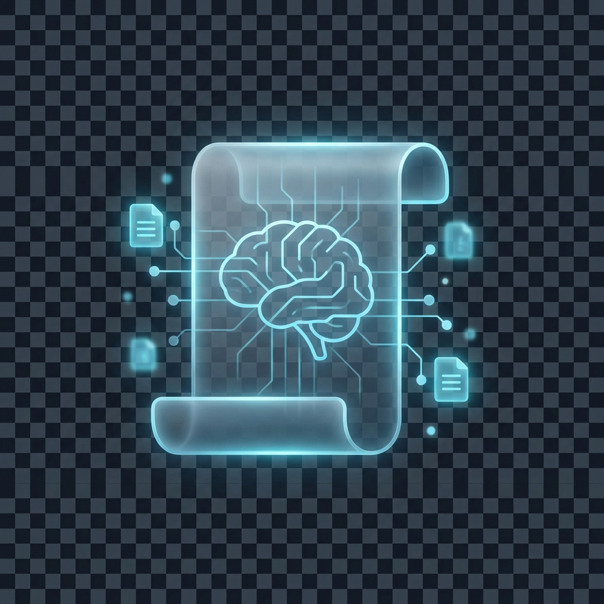
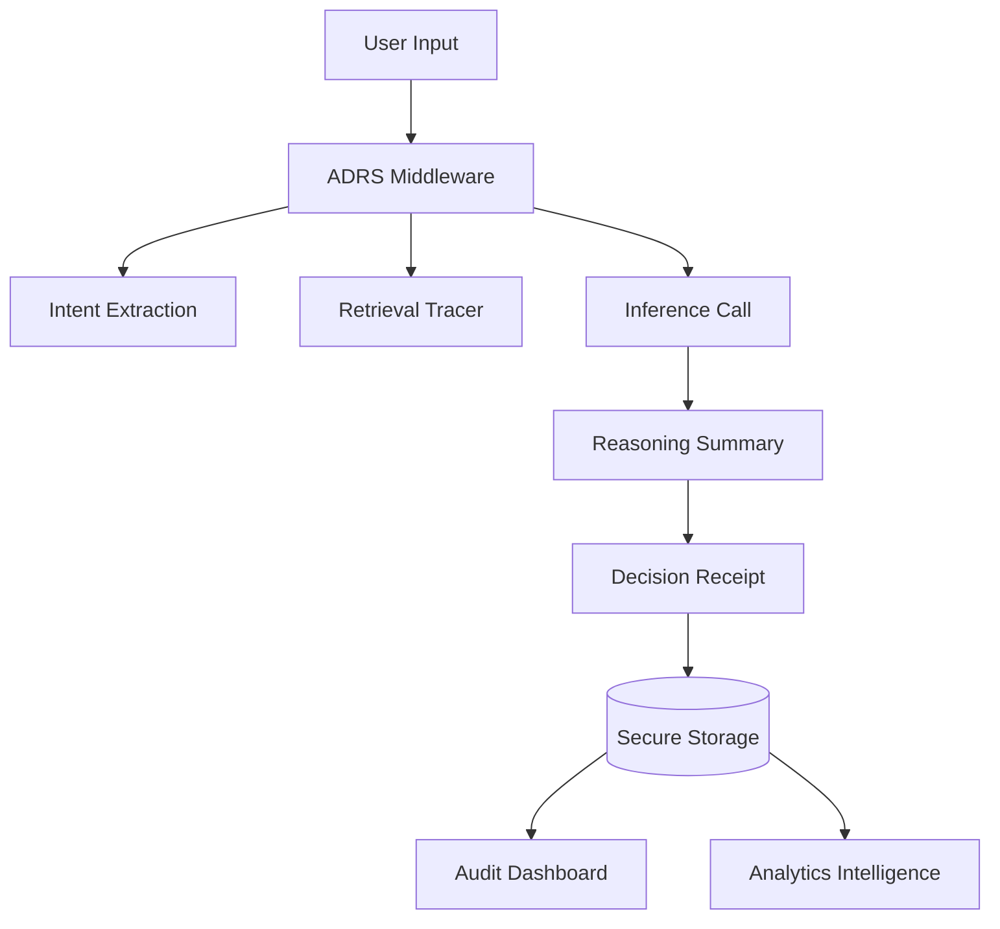

<div align="center">
  
  <h1>AI Decision Receipt System (ADRS)</h1>
  <p><b>Immutable, Traceable, and Explainable Evidence for Every AI Decision.</b></p>
  
  [](https://www.typescriptlang.org/)
  [](https://expressjs.com/)
  [](https://www.sqlite.org/)
  [](https://github.com/jenaarmaan/AI-Decision-Reciept-System)
  
  <br/>

  [](https://render.com/deploy?repo=https://github.com/jenaarmaan/AI-Decision-Reciept-System)
  
  **[LIVE PREVIEW (Temporary)](https://salty-bears-drum.loca.lt)**
</div>

---

## 📖 Introduction

In an era of rapid AI adoption, **trust is the ultimate currency**. ADRS is a high-integrity framework designed to capture, enrich, and explain AI-generated outputs. It converts ephemeral AI responses into **permanent governance artifacts**, ensuring every machine-led decision is defensible, auditable, and transparent.

> "If it isn't logged in ADRS, it didn't happen."

## ✨ core Capabilities

### 🛡️ Phase 1: Foundational Auditability
Capture the raw primitives of any AI interaction. Every decision is assigned a unique, immutable ID with full timestamping and model metadata.

### 🔍 Phase 2: Contextual Traceability
Go beyond "what" and capture "how". ADRS logs intent interpretation and retrieval sources (RAG), providing a clear audit trail of the data that influenced a decision.

### 🧠 Phase 3: Explainable Justification
Automated generation of human-readable reasoning summaries. ADRS provides "defensible explainability" without leaking internal model Chain-of-Thought (CoT).

### ⚖️ Phase 4: Human-in-the-Loop Governance
Turn logs into operational artifacts. Full support for human review, decision overrides, and role-based access control (RBAC) for auditors and admins.

### 📈 Phase 5: Decision Intelligence
Scale with confidence. Detect model drift, analyze intent trends, and surface high-risk/low-confidence anomalies before they become systemic issues.

---

## 🚀 Quick Start

### Prerequisites
- [Node.js](https://nodejs.org/) (v18+)
- [npm](https://www.npmjs.com/)

### Installation
```bash
git clone https://github.com/jenaarmaan/AI-Decision-Reciept-System.git
cd AI-Decision-Reciept-System
npm install
```

### Running the System
```bash
# Development Mode
npm run dev

# Build for Production
npm run build
npm start
```

### Verification
Execute the automated test suites to validate the core architecture:
```bash
# Verify Governance & Intelligence (Phase 5)
npx ts-node src/verify_phase5.ts
```

---

## 🏗️ Technical Architecture

ADRS is built with a focus on **Zero-Trust AI Governance**:

- **Middleware Layer**: Intercepts AI calls to inject traceability and enrichment logic.
- **Intelligence Layer**: Uses statistical analysis to detect drift and anomalies.
- **Persistence Layer**: High-performance SQLite storage (pluggable with PostgreSQL for enterprise).
- **Audit API**: Secure endpoints for dashboard views and compliance exports.



---

## 📜 Compliance & Exports
ADRS supports exporting receipts into structured governance reports.
`GET /api/receipts/:id/export` -> Returns a defensible Markdown report for legal/regulatory submission.

---

## 🗺️ Roadmap
- [ ] Multi-tenant organizational support
- [ ] Zero-Knowledge Proof (ZKP) verification for receipts
- [ ] Real-time Slack/Teams alerts for high-risk anomalies
- [ ] Support for Audio/Image multimodal receipts

## ⚖️ License
Distributed under the MIT License. See `LICENSE` for more information.

---
<div align="center">
  Built with ❤️ by <b> Armaan Jena </b> using <b>Antigravity AI</b> for the 50 Day AI Challenge.
</div>
